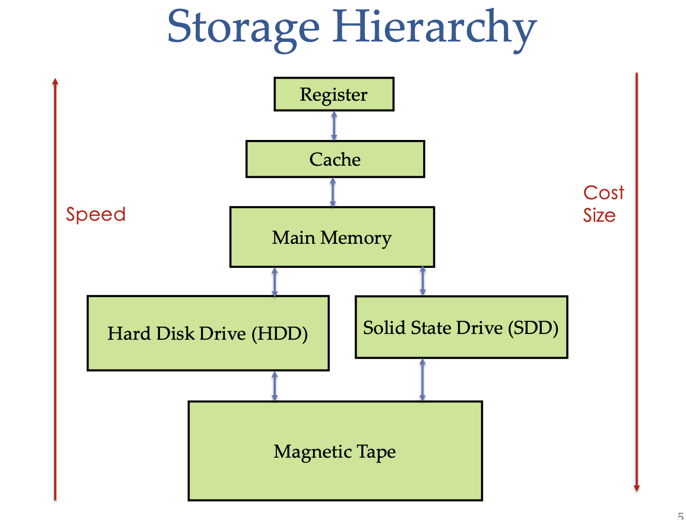
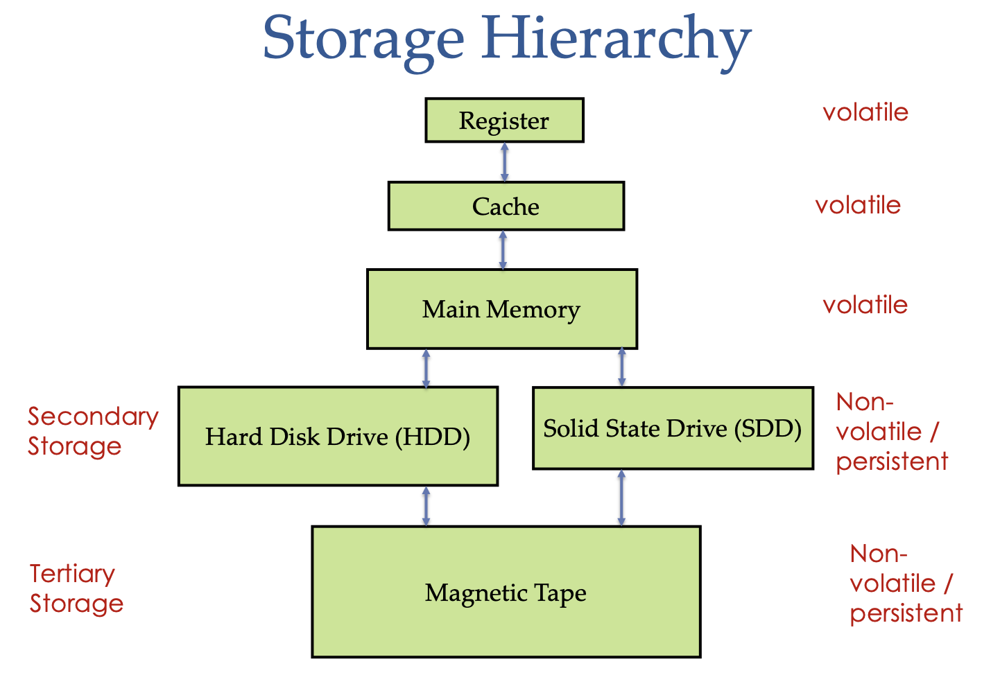
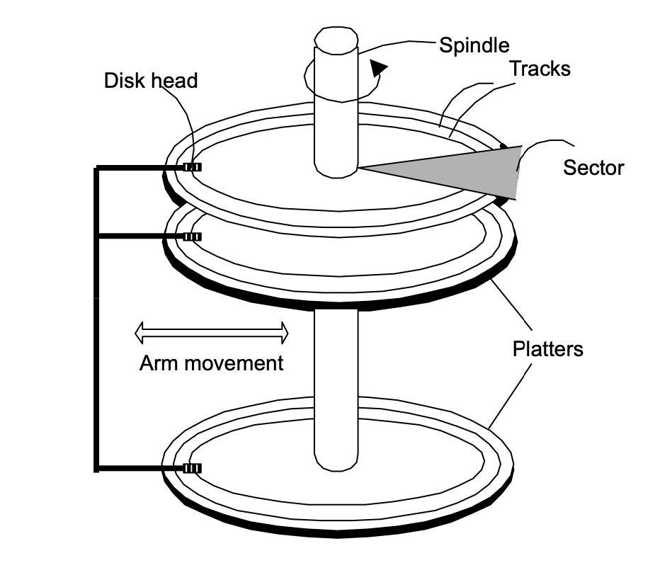
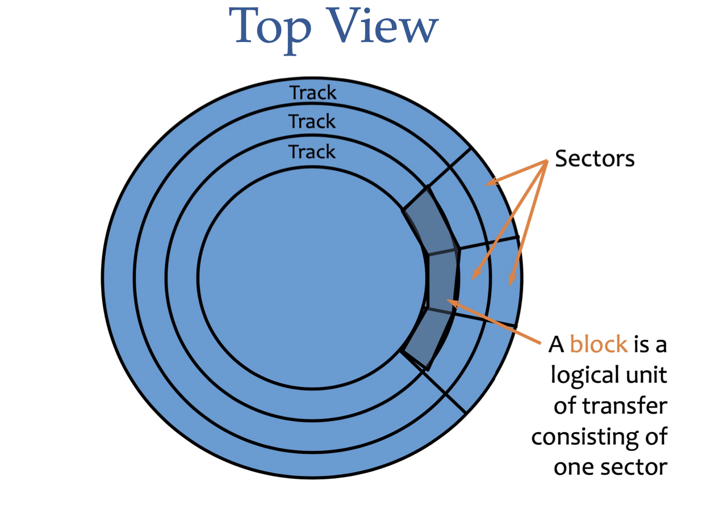
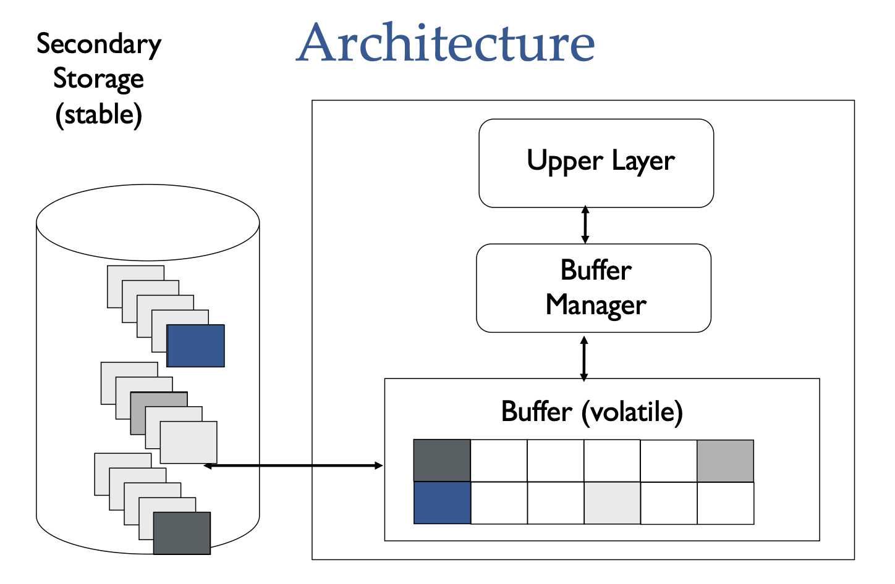

## Intro

## Entity-Relationship (ER)

## Relational Model and ER Mapping

## SQL

## Buffer Management and Managing/Accessing

### Internals of a DBSM

Memory of a computer system can be arranged into primary, secondary and tertiary storage. The I/O time is the time taken to read or write data from/to memory, and it is the most dominant factor in execution time. Primary storage which consists of the cache and main memory, is the fastest storage medium. Secondary storage such as magnetic disks is slower than primary storage, but it is more durable and cheaper than primary storage. Tertiary storage such as optical disks and tapes is the slowest and cheapest storage medium. In large database systems where the amount of data is too large to store in main memory in its entirety, data is stored on tapes and disks, with the database system retrieving data from the lower levels as needed into main memory.

Another reason asides from cost for the use of secondary and tertiary storage, is that data must be maintained across program execution, and in the event of a shutdown or crash, the storage device should retain data, i.e. be non-volatile. primary storage is usually volatile while secondary and tertiary storage is non-volatile.

### Magnetic disks

Magnetic disks are widely used in for database applications as they are relatively cheap and can store large amounts of data. The disk is composed of the following components:

- **Disk Head**: The disk head is the part of the disk that is used to read or write data.
- **Platters**: The platters are the physical disks. They are made of a magnetic material and are used to store data. **Tracks** can be recorded on one or both sides of a platter.
- **Track**: The track is the path that the read/write head travels along. It is divided into **cylinders**.
- **Cylinder**: The cylinder is the area within the track where the data is stored. It is divided into **sectors**.
- **Sector**: The sector is the smallest unit of data storage. It is divided into **blocks**.
- **Block**: The block is the smallest unit of data storage.

_Magnetic Disk Diagram_

_Magnetic Disk Top View_

While disk heads are arranged in a row with one for each recording surface, modern memory systems only allow for one disk head to read/write at a time. The reason being it is very difficult to ensure that each head is perfectly aligned on their corresponding track. Unlike main memory where accessing data from any location takes about the same amount of time, the time to access a block of memory is not constant and relies on multiple factors:

- **Seek Time**: The time taken to move the disk head to the correct track and cylinder.
- **Rotational Delay**: The time taken to rotate the disk to the correct block.
- **Transfer Time**: The time to actually read or write the data in the block.

$$
access time = seek time + rotational delay + transfer time
$$

### Buffer Manager

- **Page**: a fixed length contiguous (note not continuous) block of virtual memory on the disk.
- **Page frame**: the equivalent fixed-length block of physical memory, i.e. a region of RAM allocated to hold a memory page.
- **Buffer pool**: a collection of page frames allocated to temporarily hold pages of data from disk.

The aptly named buffer manager is the layer of software responsible for managing the buffer pool. Software in the upper layers of the DBMS simply need to ask the buffer manager for a specific page, and the buffer manager will handle checking the buffer pool and bringing the page from disk into one of the frames if it is not already there.

Upper layer software also needs to let the buffer manager know when a page is no longer needed, so that the buffer manager can free the page frame, as well as if the page frame is dirty (i.e. the page has been modified) so that the buffer manager can propogate the changes to the disk.

Thus for each frame in the pool, the buffer manager keeps track of two variables:

- **Dirty**: a boolean value that is set to true if the page has been modified since being brought into the buffer pool.
- **PinCount**: a counter that is incremented when the page frame is referenced (pinning), and decremented when the page frame is not referenced (unpinning).

If a request is made for a page that is not in the buffer pool and the pool is full, the buffer manager will look for a frame with pinCount = 0 to replace. If there are multiple frames with pinCount = 0, the replacement frame is chosen according to the replacement policy, e.g LRU, MRU, Clock, etc.. If on the other hand there is no frame with pinCount = 0, the buffer manager simply wait until a page is made available.

### Managing Records

- **Record(or Row)**: a single, logically connected set of fields that contain all the data about one particular entity

Higher levels of DBMS software do not interact with memory pages but rather store data in the familiar form of records or rows. We can then think of a memory page as a collection of slots, each of which can hold a record. An individual record can be identified by the tuple $(PageId, SlotNumber)$.

#### Fixed Length Records

In the case where records are guaranteed to be of the same length, record slots can be arranged consecutively within a page.

**Insertion**: Locate an empty slot and place the record there

**Deletion option 1**: Store records sequentially in the first free slot. Whehever a record is deleted, we move the last record on the page into the free splot.

#### Variable Length Records

poop

## Indexing

## Query Evaluation

## Transactions

## Trends - Graph Databases

## Readings

- Raghu Ramakrishnan and Johannes Gehrke: Database Management Systems; McGraw Hill, 3rd Edition
