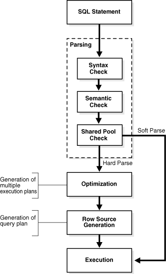
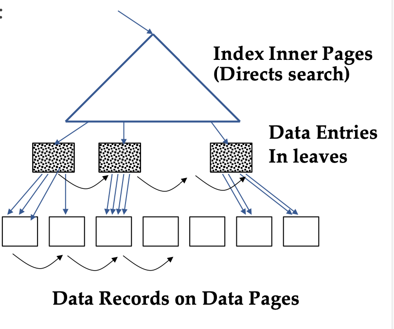
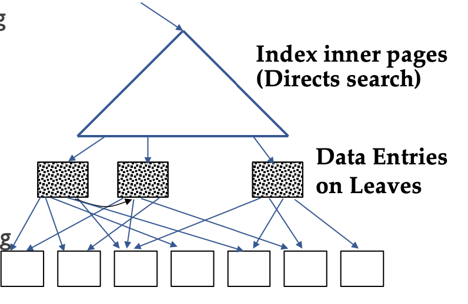
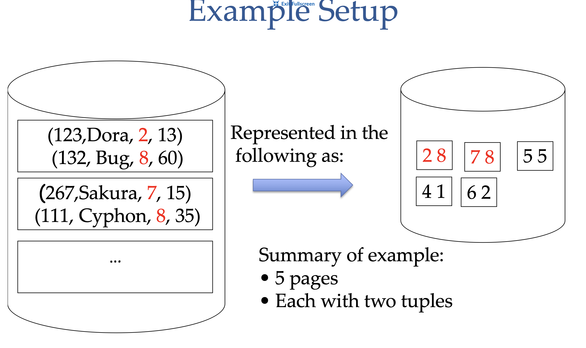
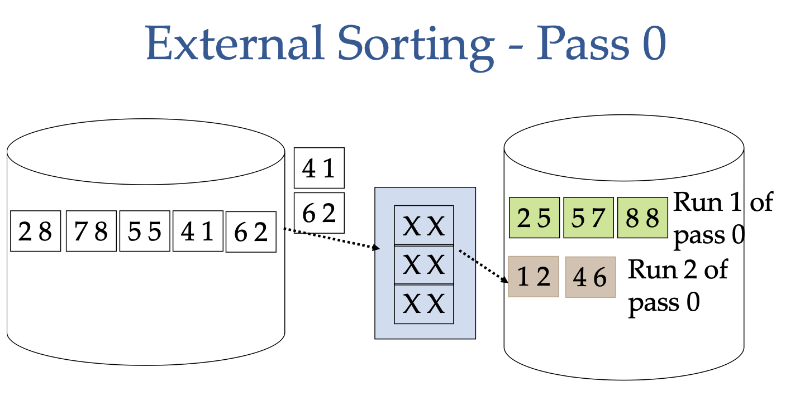
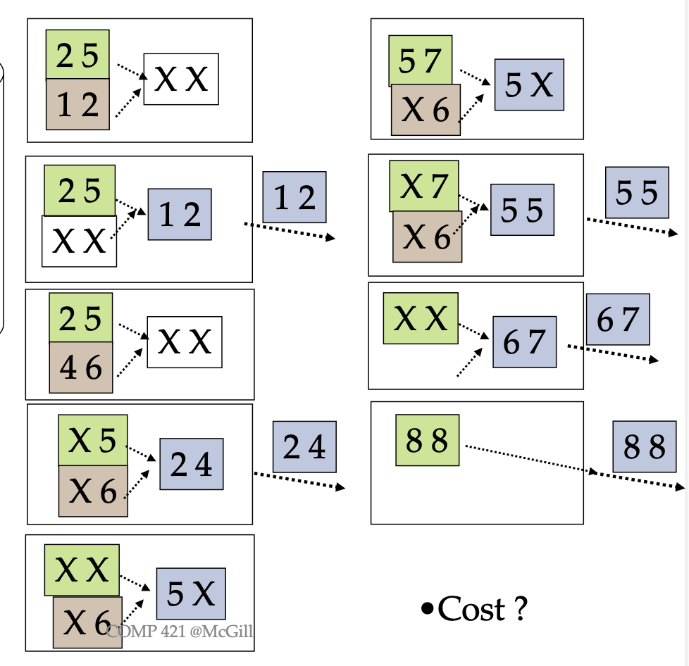

The processing of an SQL query is delegated to 3 programs:

- **Parser**: translates the SQL query into an internal query representation based on relational algebra
- **Query Optimizer**: determines the most efficient way to execute the query, i.e. determines an efficient execution plan
- **Plan Executor**: executes the plan and returns the result to the user



Queries are composed of a few **basic operators**:

- **Selection**: filters the tuples based on a condition
- **Projection**: selects specific attributes from the tuples
- **Order By**: orders the tuples based on a specific attribute
- **Join**: combines the tuples of two queries based on a common attribute
- **Group By**: groups the tuples based on a specific attribute and applies an aggregate function to each group
- **Intersection**: returns the tuples that are present in both queries
- **etc...**

## Cost model and notation

There are multiple ways of implementing each relational operator, thus we must estimate how expensive a specific execution is to be able to choose the most efficient. As a general back of napkin calcuation, we will compare performance based on number of I/O i.e pages retrieved from disk. We make a few simplifying assumptions:

- the root and intermediate nodes of the B+ tree are in main memory
- leaf nodes and data pages are not in memory

## Schema for our example

```SQL

Users (uid: int, uname: string, experience: int, age: int)
```

```SQL
GroupMembers (uid: int, gid: int, stars: int)
```

<table>

<tr>
<td>

Users(U):

- 40,000 tuples, denoted as |U|
- around 80 tuples per page
- 500 data pages/block
- index on UID has 170 leaf pages
- index on uname has around 300 leaf pages

</td>
<td>
GroupMembers(GM):

- 100,000 tuples (denoted as |GM|)
- Around 100 tuples per data page/block
- Total of 1000 data pages (denoted as GroupMemberPages)
</td>
</tr>
</table>

## Selection

```SQL
SELECT  *
FROM    Users
WHERE   uid = 123
```

### Reduction factor

The **reduction factor** of a condition is the ratio of the number of tuples in the result to the number of tuples in the original table. It is used to determine the efficiency of the query; the higher the reduction factor, the more efficient the query is. Given a relation $R$, it can be expressed as

$$
\text{Red}(\sigma_{\text{condition}}(R)) = \frac{|\sigma_{\text{condition}}(R)|}{|R|}
$$

<mark>Example</mark>

Assume there are 10 different experience levels for User, and we want to calculate the reduction factor for the condition when the user has experience of 5. it can be calculated as:

$$
\text{Red}(\sigma_{\text{experience}=5}(U)) = \frac{1}{|\text{all experience levels}|} = 0.1
$$

When calculating execution efficiency, the value of $|\sigma_{\text{condition}}(R)|$ is not known, so a common solution is for the DBMS to keep track of the number of different values and assume a uniform distribution. This is done through various methods e.g indices, heuristics, histograms, etc.

Execution Options:

1. Simple scan on data pages

- always possible, even with indices
- I/O cost = # of data pages
- if search on primary key, average I/O cost = 1/2 # of data pages

2. Use an index on the condition attribute

- Case 1. clustered index tree
- Case 2. non-clustered index tree

### Clustered Index tree



Step 1. Go from the root to the left-most leaf _lq_ with qualifying data entry.

- cost = one I/O to retrieve _lq_ page

Step 2. retrieve page of first qualifuing tuple within _lq_ leaf.

- cost = one I/O

Step 3. keep moving to adjacent leaves as long as search criteria is fulfilled. Each move to an adjacent leaf is an additional I/O

- Since clustered, each data page is only retrieved once.
- cost = proportion of tuples that match is roughly equal to proprtion of data pages that match - if ~20% of tuples qualify then ~ 20% of data pages are retrieved.

<mark>Example</mark>

```SQL
SELECT * FROM Users WHERE uid = 123
```

Since uid is the primary key, only one tuple will match, thus I/O cost = cost of step 1. = retrieve _lq_ page + retrieve corresponding data page = 2

<mark>Example</mark>

```SQL
SELECT * FROM Users WHERE uname = "John"
```

Let's assume there are 100 matching tuples for the query. Since we know for users there are around 80 tuples/page, the matching tuples will be spread across 2 pages. Therefore the I/O cost will be _lq_ + 2 data pages = 3

<mark>Example</mark>

```SQL
SELECT * FROM Users WHERE uname < 'G'
```

Let's assume there are 10000 matching tuples for the query. That means 25% of the tuples are a match, which means we will need to access roughly 25% of the memory pages. Therefore the I/O cost will be _lq_ + 125 data pages = 126

_Note: some systems might retrieve all rids through the index (not efficient). – In this case, example 3 will read approx. 25% of the leaf pages._

### Non-clustered Index tree: standard strategy



Step 1. Go from the root to the left-most leaf _lq_ with qualifying data entry.

- cost = one I/O to retrieve _lq_ page

Step 2. retrieve page of first qualifuing tuple within _lq_ leaf.

- cost = one I/O

Step 3. keep moving to adjacent leaves as long as search criteria is fulfilled. Each move to an adjacent leaf is an additional I/O

- Since non-clustered, each new tuple might be in a different memory page.
- cost = no correlation between page I/O cost and number of tuples retrieved. worst case scenario is need to do a new page I/O per tuple.

Non-clustered Index usually only useful with very small reduction factors

### Non-clustered index: Sorting strategy

1. Determine all leaf pages that have matching entries
2. sort the matching data entries by their page-id
3. Retrieve each memory page only once and get all matching tuples

The advantage is that the worst case scenario is upper bounded by # of data pages + # of leaf pages. We will never need to make an I/O multiple times for one memory page since the entries are sorted by their page-id. Thus depending on how the tuples are distributed among the memory pages, it is possible to be more efficient than a simple scan.

### Selection on 2 or more attributes

Let's say we are making a selection query for all tuples whose attribute A =100 and attribute B = 50, and our relation has 500 pages.

Option 1. No index

- simple scan: 500 pages, 1 I/O for each page -> 500 I/Os

Option 2. Index on A

- get all the tuples where A=100 through the index, and then check their B value
- cost = cost to query for A=100

Option 3. Create 2 indexes; one for each attribute

- 1. get all the tuples where A=100 through the A index,
- 2. get all the tuples where B=50 through the B index
- 3. build and return an intersection of all the tuples
- cost = cost to query for A=100 + cost to query for B=50

**Now lets consider a selection query for A=100 OR B=50**

Option 1. No index

- simple scan: 500 pages, 1 I/O for each page -> 500 I/Os

Option 2. Index on A

- Not useful, since it is an OR condition

Option 3. Create 2 indexes; one for each attribute

1. get all the tuples where A=100 through the A index
2. get all the tuples where B=50 through the B index
3. Build and return the union of the tuples

- cost = cost to query for A=100 + cost to query for B=50

**Main memory usage note**

- A scan over a relation only needs two main memory frames: 1 for output, 1 for input
- Index tree additionally needs to hold root and intermediate pages, and space to retrieve one leaf page at a time
- Index tree with sorting/intersection additionally needs to hold root and intermediate pages, as well as necessary leaf pages for sorting/intersection.

## Projection

```SQL
SELECT uid, experience
FROM Users
```

projection is often used together with other operators in one query

```SQL
SELECT uid, experience
FROM Users
WHERE experience > 5
```

For projection, decide how to do the other operations first, and then do the projection on the fly.

## External Sorting



Say we would like to sort 5 pages of data, each with two tuples, and we only have 3 buffer frames available to us. The way we can do this is:

1. Load 3 pages into the buffer frames
2. Sort the tuples in the buffer frames
3. Write the sorted tuples to disk (this is one run)
4. Repeat steps 1-3 for the remaining pages (this is one pass)

The cost = 1 I/O per page to load into the buffer frames, and 1 I/O per page to write to disk = 2(# of pages) for pass 0



Once we have each run sorted, we can merge them together to get the final sorted result. This can be done with just a linear merge, comparing the smallest elements between the runs and picking the smallest each time.

The cost = 1 I/O per page to merge the runs, and typically the output is given directly to the client so there is no additional write I/O, i.e. cost = (# of pages) for Pass 1

The general I/O cost is given by the formula

$$
(2N-1)(N)
$$

Where $N$ is the number of pages.



Sometimes, a second pass is needed if pass 0 creats more runs than there are main memory buffers. A general solution to calculate # of passes needed is:

$$
1 + \left\lceil \log_{B-1} \left(\frac{N}{B}\right) \right\rceil
$$

where $N$ is the number of pages, and $B$ is the number of buffer frame.
