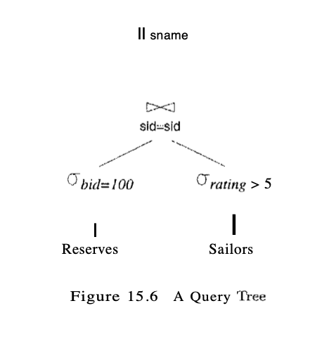
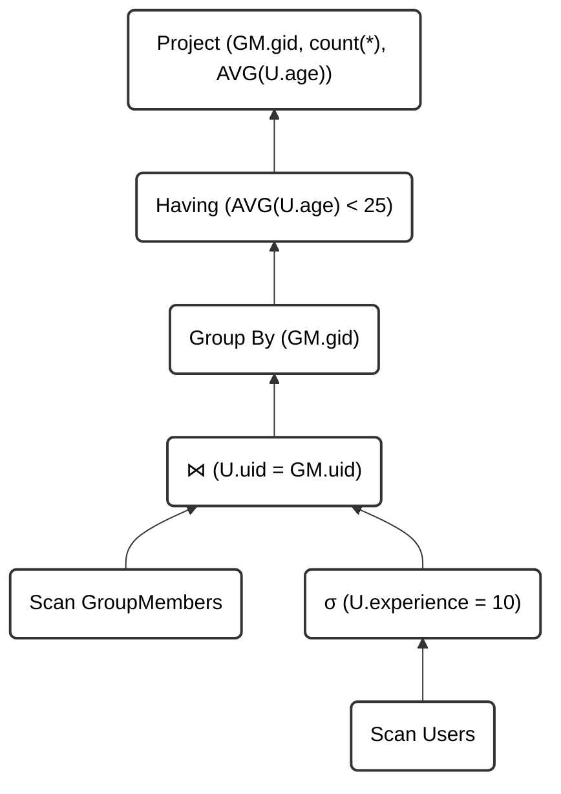
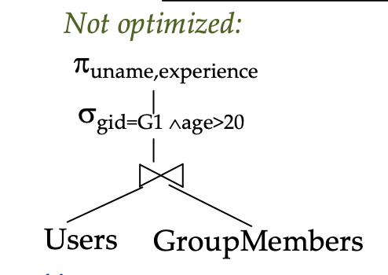
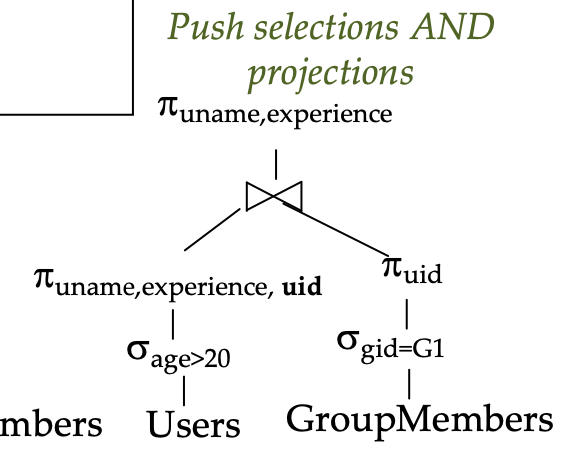

Execution Tree:

- **Leaf Nodes**: base relations
- **Inner Nodes**: operators
- **Tuples** from the base relations flow into the parent operator nodes
- Output of an opterator nodes flows into the parent node
- Output of the root flow as result to the client



<mark>Example</mark>

```SQL
SELECT GM.gid, count(*), AVG(U.age)
FROM Users U, GroupMembers GM
WHERE U.uid = GM.uid AND U.experience = 10
GROUP BY GM.gid
HAVING AVG(U.age) <25
```

A corresponding example execution tree:



## Pipelining

- **Definition 1**: As soon as an output tuple of an operator is found, it is forwarded to the next operator

- **Definition 2**: As soon as one ouput frame in the memory buffer is full, it is processed by the next operator
- Enables parallel execution of operators
- No write to disk costs for intermediate relations if it can be avoided

<mark>Example</mark>

```SQL
SELECT *
FROM Users U, GroupMembers GM
WHERE U.uid = GM.uid
AND experience = 10
```

Assumptions:

- 50 buffer frames available
- 40,000 tuples on 500 UserPages
- 1,000 GroupMember pages
- 1% of users have experience = 10 i.e. 400 users
- Each User tuple has on average 2.5 GM tuples
- In the execution tree, selection is done first, and the resulting tuples are pipelined directory to the join

**Which join is best?**

<ins>Block Nested Loop</ins>

Cost:

$$
\text{UserPages} + \frac{\text{UserPages} \times 0.01}{50} \times \text{GroupMemberPages} = 500 + 1 \times 1000 = 1,500
$$

<ins>Index Nested Loop</ins>

Cost:

$$
\text{UserPages} + |\text{Users}| \times 0.01 \times \text{Cost finding GroupMembers} = 500 + 400 \times (1 + 2.5) = 500 + 1400 = 1900
$$

<ins>Sort Merge Join</ins>

Cost:

$$
\text{UserPages} + 3 \times \text{GroupPages} = 3500
$$

## Optimization Techniques

Two types of optimization techniques:

- **Cost-Based Optimization**:

  - Calculate and compare the I/O cost of possible implementations of operators.

- **Algebraic Optimization**:

  - Prioritize operations that eliminate a lot of tuples
  - push down selections and projections
  - Order joins to have intermediate results with minimum number of tuples and tuple size

  ## Algebraic Optimization

Push down projections, selections and joins to their respective relations

Note: need to be careful that projecting does not remove attributes that might be needed later on in.

<mark>Example</mark>

```SQL
SELECT u.name, u.experience
FROM Users U, GroupMembers g
WHERE u.uid = g.uid
AND g.gid = "G1"
AND u.age > 20
```

This query can be expressed in algebraic form as:

$$
\pi_{\text{uname, experience}}(\sigma_{\text{gid} = 'G1' \land \text{age} > 20} (\text{Users} \bowtie \text{GroupMembers}))
$$

where the order of operators is first join, then selection, then projection.





Pushing projections down the execution tree wont reduce the number of tuples but it will reduce the memory size of intermediate results as attributes are trimmed from each tuple.

````mermaid
graph BT;
    A("GroupMembers") --> B("σ_gid=G1")
    C("Users") --> D("σ_age>20")
    D --> E("π_uname,experience,uid")
    B --> F("π_uid")
    E --> G("⋈")
    F --> G
    G --> H("π_uname,experience")
    H --> I("Push selections AND projections")

    style A fill:#fff,stroke:#333,stroke-width:2px, color:#000;
    style B fill:#fff,stroke:#333,stroke-width:2px, color:#000;
    style C fill:#fff,stroke:#333,stroke-width:2px, color:#000;
    style D fill:#fff,stroke:#333,stroke-width:2px, color:#000;
    style E fill:#fff,stroke:#333,stroke-width:2px, color:#000;
    style F fill:#fff,stroke:#333,stroke-width:2px, color:#000;
    style G fill:#fff,stroke:#333,stroke-width:2px, color:#000;
    style H fill:#fff,stroke:#333,stroke-width:2px, color:#000;
    style I fill:#fff,stroke:#333,stroke-width:2px, color:#000;```

````

## General rules of thumb

- If the application has certain kinds of queries that will be run frequently, create appropriate indexes to speed up these queries
- If the application has many updates and inserts, be conservative with creating indexes for the relevent relations since each INSERT/UPDATE will also change the index tree.
- ` SQL EXPLAIN` explains how a query is executed internally.
